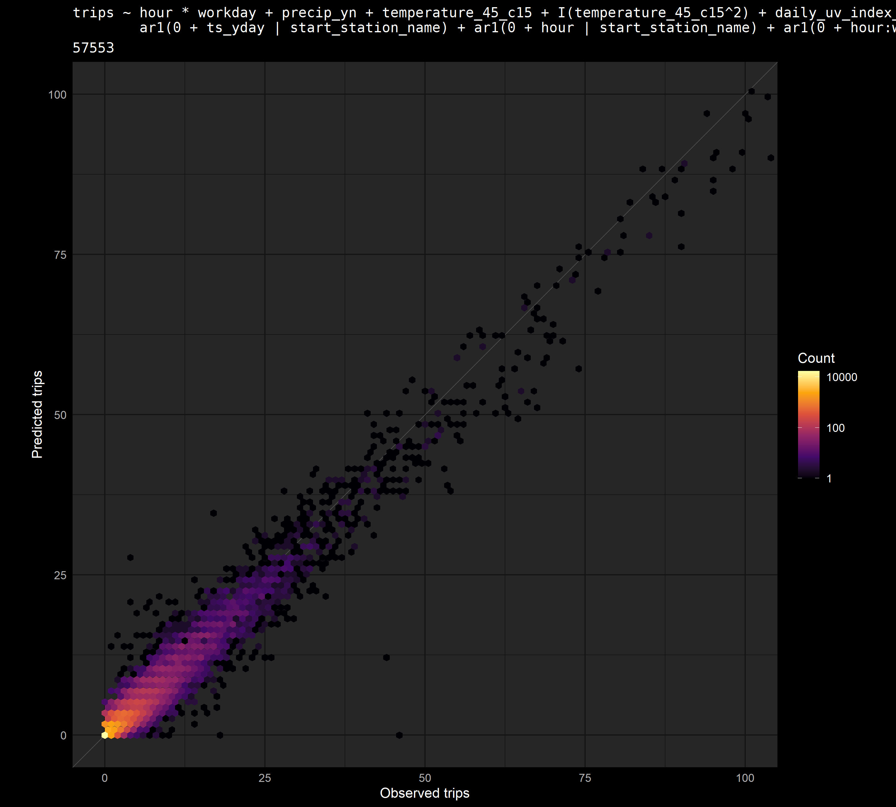

# Modeling Citi Bike trips in 2018

Fitting a generalized linear mixed effects model to trip, station and weather data, starting from the raw data files.

## Data pipeline

### Code for getting data and saving to SQLite databases

#### Trip data

Trip data can be retrieved from the Citi Bike [system data page](https://www.citibikenyc.com/system-data) (or from the [AWS S3 Bucket](https://s3.amazonaws.com/tripdata/index.html)).

[`downloading_trip_data.R`](code/downloading_trip_data.R)  
[`trips_database.R`](code/trips_database.R)  

#### Station status data

Station status data can be retrieved from Citi Bike's [GBFS data feed](https://gbfs.citibikenyc.com/gbfs/en/station_status.json).

[`building_station_status_database_from_archive.R`](code/building_station_status_database_from_archive.R)  
[`station_status_database.R`](code/station_status_database.R)  

#### Weather data

Data obtained through [NOAA NCEI](https://www.ncei.noaa.gov/) API.

[`nyc_weather_database.R`](code/nyc_weather_database.R)  

### Combining and processing

[`combining_trips_station_weather_data.R`](code/combining_trips_station_weather_data.R)  
[`computing_covariates.R`](code/computing_covariates.R)  

## Analysis

### Model fitting

#### Code for running models and producing vizualizations:

[`glmmTMB_size.R`](code/glmmTMB_size.R)  

##### Model fitting helper function:

[`glmmTMB_size_testing.R`](code/functions/glmmTMB_size_testing.R)  

##### Functions for model diagnostic plots:

[`diagnostic_plots.R`](code/functions/diagnostic_plots.R)  
[`resid_patterns.R`](code/functions/resid_patterns.R)  

### Computing and vizualizing predictions

[`computing_model_predictions_on_grid.R`](code/computing_model_predictions_on_grid.R)  
[`visualizing_model_predictions.R`](code/visualizing_model_predictions.R)  

**Example plots are in the folder [plots/time_series/2018/glmmTMB_fit_m345_20s_genpois_141213](plots/time_series/2018/glmmTMB_fit_m345_20s_genpois_141213)**, and are based on a model fitted on data from March, April, and May of 2018 (*"m345"*), with a sample of 20 stations (*"20s"*), using a generalized Poisson distribution (*"genpois"*).

## Plots

### Diagnostics

#### Observed vs. Fitted: Scatterplot

Scatterplot heatmap using `ggplot2::geom_hex()`, with `binwidth = 1`; original points represent number of trips during a single hour, on a single date, at a single station. Most fitted values are within 7 trips of the observed value, and fitted values are pretty evenly distrbuted around the 1:1 line, with a bias towards under-predicting number of trips, which is to be expected when using a mixed model.

  

# Other Visualizations

## Mapping trip counts with `leaflet`

This map displays Citi Bike trips taken in April of 2019. The default layer displays each station in the system, along with its total trips. Clicking on a point will show the number of trips that started at that station, and how many of those trips ended at each station in the system.

**See map at https://cgettings.github.io/Citi-Bike-Trips/**

([`code`](code/station_trips_leaflet.R))

