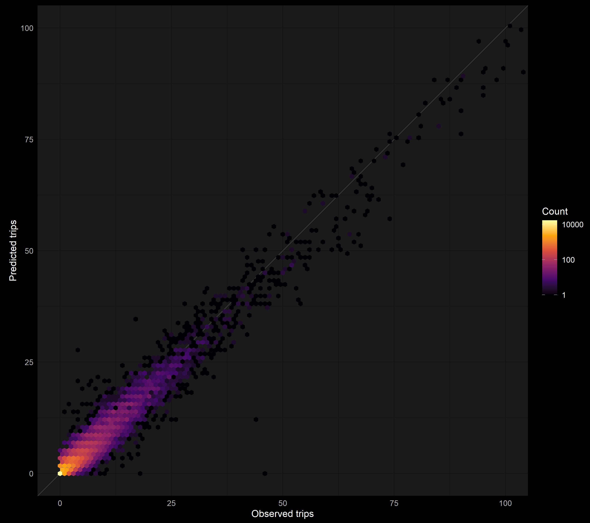
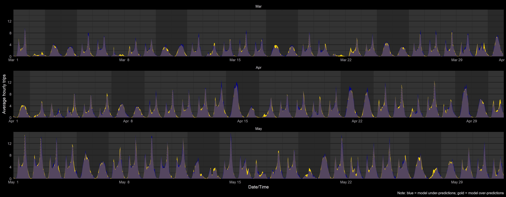
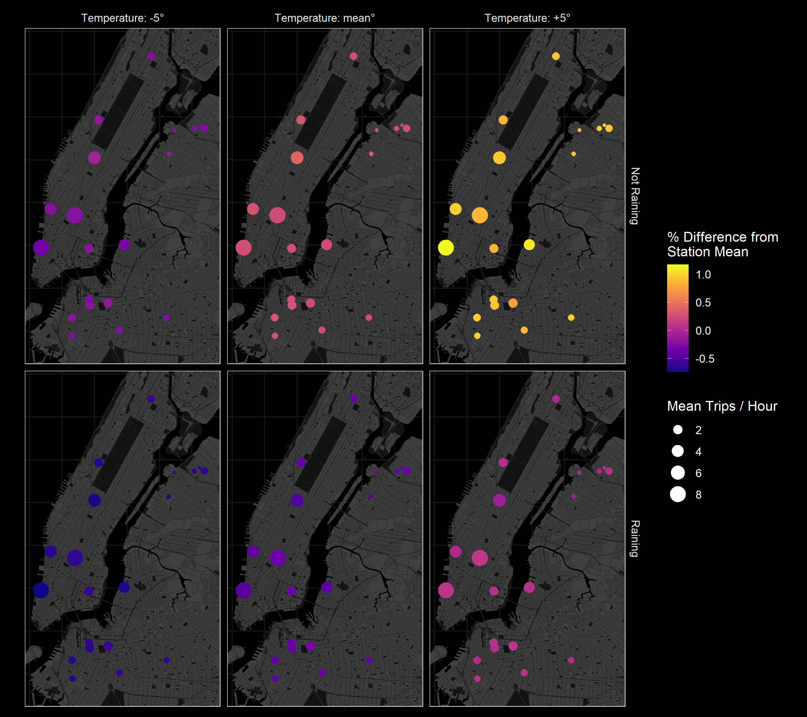

```{r setup, include=FALSE}
knitr::opts_chunk$set(echo = FALSE)
```

```{r libraries, include=FALSE}

library(tidyverse)
library(leaflet)
library(fs)
library(here)
library(knitr)
library(rmarkdown)

``` 

## **Overview**

<div style = "text-align: left; padding: 20px 0px 0px 0px;">

  <div class="fragment" data-fragment-index="1"> - Project</div>
  <div class="fragment" data-fragment-index="1"> &emsp; - Description</div>
  <div class="fragment" data-fragment-index="1"> &emsp; - Rationale</div>
  <div class="fragment" data-fragment-index="2"> - Data pipeline (all in **`R`**)</div>
  <div class="fragment" data-fragment-index="2"> &emsp; - Getting data</div>
  <div class="fragment" data-fragment-index="2"> &emsp; - Building analysis dataset</div>
  <div class="fragment" data-fragment-index="2"> &emsp; - Final data example</div>
  <div class="fragment" data-fragment-index="3"> - Analysis</div>
  <div class="fragment" data-fragment-index="3"> &emsp; - Description</div>
  <div class="fragment" data-fragment-index="3"> &emsp; - Model specification</div>
  <div class="fragment" data-fragment-index="4"> - Findings</div>
  <div class="fragment" data-fragment-index="4"> &emsp; - Checking model fit</div>
  <div class="fragment" data-fragment-index="4"> &emsp; - Predictions</div>
  <div class="fragment" data-fragment-index="5"> - Future directions</div>

</div>

## **Project**

Mapping and analyzing Citi Bike trips in NYC  
<small>(on Github @ cgettings/Citi-Bike-Trips)</small>

<div class="fragment" data-fragment-index="1" style="color: navy; font-size: 90%; text-align: left;">*Can I predict station traffic, given a timestamp, a docking station, and a weather forecast?*</div>

<br>

<h3 class="fragment" data-fragment-index="2">**Why do it?**</h3>

<div class="fragment" data-fragment-index="3"> - Interesting, complex</div>
<div class="fragment" data-fragment-index="3"> - Useful for planning bike redistribution</div>
<div class="fragment" data-fragment-index="3"> - An excuse to learn cool stuff</div>

<br>

<h3 class="fragment" data-fragment-index="4">**Why present it?**</h3>

<div class="fragment" data-fragment-index="5"> - Interesting, complex</div>
<div class="fragment" data-fragment-index="5"> - Responsible for many of my data science skills</div>

## **Data pipeline:** Getting data

<!-- ### Getting data -->

<div style = "text-align: left; padding: 20px 0px 0px 0px;"> **Target:** Local SQLite tables with data on Citi Bike trips, station status, and weather conditions </div>

<div style = "text-align: left; font-size: 80%; padding: 20px 0px 0px 0px;">

 <div class="fragment" data-fragment-index="2">1. Check for new data </div>
 <div class="fragment" data-fragment-index="7">&ensp;2. &#x21AA; Get new data </div>
 <div class="fragment" data-fragment-index="11">&emsp;3. &#x21AA; Process + upload to database </div>
  
 <div style="font-size: 70%; padding: 20px 0px 0px 0px;">
  
  <div class="fragment" data-fragment-index="1" style="padding: 10px 0px 0px 0px;"> **Trip data:** </div>
  
  <div class="fragment" data-fragment-index="3"> &ensp; S3 bucket &harr; Local CSV files </div>
  <div class="fragment" data-fragment-index="8"> &emsp; &#x21AA; **&#x2913;** new CSV files &rarr; &#x1f4be; </div>
  <div class="fragment" data-fragment-index="12"> &ensp;&emsp; &#x21AA; SQLite </div>
  
  <div class="fragment" data-fragment-index="1" style="padding: 10px 0px 0px 0px;">**Station status data:** </div>
  
  <div class="fragment" data-fragment-index="4"> &ensp; Public Google Drive folder <small>(old way)</small> </div>
  <div class="fragment" data-fragment-index="9"> &emsp; &#x21AA; **&#x2913;** + &#x1f4be; all CSV files </div>
  <div class="fragment" data-fragment-index="12"> &ensp;&emsp; &#x21AA; SQLite </div>
  
  <div class="fragment" data-fragment-index="4" style="padding: 5px 0px 0px 0px;"> &ensp; AWS server &harr; Local JSON files<small>(new way)</small> </div>
  <div class="fragment" data-fragment-index="9"> &emsp; &#x21AA; **&#x2913;** new JSON files &rarr; &#x1f4be; </div>
  <div class="fragment" data-fragment-index="12"> &ensp;&emsp; &#x21AA; SQLite </div>
  
  <div class="fragment" data-fragment-index="1" style="padding: 10px 0px 0px 0px;">**Weather data:** </div>
  
  <div class="fragment" data-fragment-index="6"> &ensp; NOAA API &harr; SQLite </div>
  <div class="fragment" data-fragment-index="10"> &emsp; &#x21AA; **&#x2913;** new records (as CSV) </div>
  <div class="fragment" data-fragment-index="12"> &ensp;&emsp; &#x21AA; SQLite </div>
  
 </div>
</div>


## **Data pipeline:** Building analysis dataset

<div style = "text-align: left; padding: 20px 0px 0px 0px;"> **Target:** One combined dataset for 2018 </div>

 <div style = "text-align: left; font-size: 80%; padding: 30px 0px 0px 0px;">

  <div class="fragment" data-fragment-index="1" style = "padding: 20px 0px 0px 0px;">1. Extract subset </div>
  <div class="fragment" data-fragment-index="1" style="font-size: 75%;"> &ensp; - Filter: **`year == 2018`** for **`trips`**, **`status`**, and **`weather`** tables </div>
  
  <div class="fragment" data-fragment-index="2" style = "padding: 20px 0px 0px 0px;"> &ensp;2. &#x21AA; Summarize </div>
  <div class="fragment" data-fragment-index="2" style="font-size: 75%;"> &emsp; - Summarize key variables for each **`date`** x **`hour`** ( x **`start_station`**) combination </div>
  
  <div class="fragment" data-fragment-index="3" style = "padding: 20px 0px 0px 0px;"> &emsp;3. &#x21AA; Combine </div>
  <div class="fragment" data-fragment-index="3" style="font-size: 75%;"> &ensp;&emsp; - Join on **`date`** & **`hour`** </div>
  
  <div class="fragment" data-fragment-index="4" style = "padding: 20px 0px 0px 0px;"> &ensp;&emsp;4. &#x21AA; Process </div>
  <div class="fragment" data-fragment-index="4" style="font-size: 75%;"> &emsp;&emsp; - Create derived variables & rescale predictors </div>
  
</div>

## **Data pipeline:** Building analysis dataset

### Creating derived variables

```{r eval=FALSE, echo=TRUE}
mutate(
    workday = if_else(wday_wend == "weekday" & isholiday == FALSE, TRUE, FALSE),
    
    total_trend_yearly = (yday(date)-1)/(365.25),
    sin_year           = sin(2 * pi * total_trend_yearly),
    cos_year           = cos(2 * pi * total_trend_yearly)
)
```

#### Is a station in service?

```{r eval=FALSE, echo=TRUE}
data %>% 
    group_by(start_station_name, date) %>% 
    mutate(
        no_trips_hours = sum(trips == 0, na.rm = TRUE),
        n_hours = length(trips)
    ) %>% 
    mutate(
        in_service_trips = if_else(no_trips_hours == n_hours, 0L, 1L),
        in_service = 
            case_when(
                (!is.finite(station_status) & in_service_trips == 0L) | station_status == "out_of_service" ~ 0L,
                (!is.finite(station_status) & in_service_trips == 1L) | station_status == "active" ~ 1L
            )
)
```

## **Data pipeline:** Building analysis dataset

### Rescaling predictors

```{r eval=FALSE, echo=TRUE}
mutate(
    sin_year_r_2 = sin_year/2,
    cos_year_r_2 = cos_year/2,
    
    temperature_45_c15 = (temperature - 15)/45
)
```


## **Data pipeline:** Final data example

```{r cache=TRUE, include=FALSE}

data_dir <- "data/2018"

trips_station_weather_data <- 
    read_rds(
        path(
            data_dir, 
            "trips_station_weather_data_extra_2018.rds" 
        )
    ) %>% 
    arrange(start_station_id, date, hour) %>% 
    head(10) %>% 
    select(
        date,
        start_station_name,
        start_station_longitude,
        start_station_latitude,
        in_service_fct,
        capacity_med_30_c30,
        trips,
        hour,
        wday,
        workday,
        ts_yday,
        total_trend_yearly,
        sin_year_r_2,
        cos_year_r_2,
        precip_yn,
        temperature_45_c15,
        humidity_100_c60,
        dew_point_45_c7,
        daily_uv_index_10_c5
    )

gc()

```

```{r}

trips_station_weather_data %>% mutate(across(where(is.numeric), ~ round(.x, 1))) %>% paged_table()

```


## **Analysis:** Description

<div style = "text-align: left; padding: 30px 0px 0px 0px;"> 
 
<div class="fragment" data-fragment-index="1"> - Modelling # of trips / hour that **start** at a given station </div>
 
 <div style="font-size: 80%; padding: 0px 0px 0px 0px;">
 
  <span class="fragment" data-fragment-index="2">&emsp; - Generalized linear mixed model,</span>
  <span class="fragment" data-fragment-index="3"> generalized Poisson distribution</span><br>
  <span class="fragment" data-fragment-index="4">&emsp; - **`{glmmTMB}`** package in **`R`**</span><br>
  <span class="fragment" data-fragment-index="5">&emsp; - Small subset: 20 stations, March - May of 2018</span>
  
 </div>
</div>

## **Analysis:** Model specification for **`{glmmTMB}`**

<small>**`glmmTMB_size_testing`** samples the data, fits the model with **`{glmmTMB}`**, gives details on progress, appends model summary output to CSV file, and returns a list with the fitted model object and some metadata</small>

```{r eval=FALSE, echo=TRUE}

    glmmTMB_size_testing(
        
        trips ~ 
            
            hour * workday + 
            
            precip_yn +
            
            temperature_45_c15 +
            I(temperature_45_c15 ^ 2) + 
            
            daily_uv_index_10_c5 +
            I(daily_uv_index_10_c5 ^ 2) +
            
            humidity_100_c60 +
            I(humidity_100_c60 ^ 2) +
            
            dew_point_45_c7 +
            I(dew_point_45_c7 ^ 2) +
            
            total_trend_yearly +
            
            sin_year_r_2 +
            cos_year_r_2 +
            
            capacity_med_30_c30 +
            in_service_fct +
            
            us(1 | start_station_name) +
            
            ar1(0 + ts_yday | start_station_name) + 
            ar1(0 + hour | start_station_name) + 
            
            ar1(0 + hour:workday | start_station_name) + 
            ar1(0 + hour:ts_yday | start_station_name) + 
            
            ar1(0 + hour:wday:workday | start_station_name) + 
            ar1(0 + hour:precip_yn:workday | start_station_name) +
            
            ar1(0 + hour:precip_yn:temperature_45_c15 | start_station_name) +
            ar1(0 + hour:precip_yn:humidity_100_c60 | start_station_name) +
            
            ar1(0 + hour:workday:temperature_45_c15 | start_station_name) +
            ar1(0 + hour:workday:humidity_100_c60 | start_station_name),
            
        family = "genpois",
        data = trips_station_weather_data,
        months = 3:5,
        n_stations = 50,
        seed = 726, 
        output_dir = output_dir,
        verbose = FALSE,
        profile = TRUE,
        optCtrl = optCtrl,
        csv_name = csv_name
    )

```


## **Findings:** Checking model fit

##

<div style = "text-align: left; font-size: 75%;">**Model fit:** Scatter-heatmap of observed vs. predicted trips</div>


##

<div style = "text-align: left; font-size: 75%;">**Model fit:** Observed vs. predicted trips, by time</div>


## **Findings:** Predictions

##

<div style = "text-align: left; font-size: 75%;">**Predictions:** Predicted trips by station under hypothetical weather conditions</div>


## **Future directions**

> - Reproducible pipeline with **`{drake}`**
> - Cross validation with different subsets
> - More sophisticated diagnostics with **`{DHARMa}`**
> - Interactive **`{leaflet}`** map

## Thank you!
