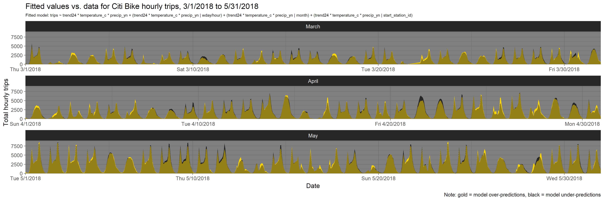

# NYC Citi Bike Trips
Project exploring Citi Bike trips in New York City

Trip data can be retrieved from the Citi Bike [system data page](https://www.citibikenyc.com/system-data) (or from the [AWS data repository](https://s3.amazonaws.com/tripdata/index.html)).

## Building a model of Citi Bike trips for March, April & May of 2018

This repository contains the code needed to fit a linear mixed effects model to Citi Bike trip data, starting from raw data files.

**In [`code/trips_database.R`](code/trips_database.R)**
* Code for creating a SQLite database of Citi Bike trip histories extracted from .zip files downloaded from the links above.

**In [`code/building_nyc_weather_database.R`](code/building_nyc_weather_database.R)**
* Code for creating a database of NYC-area weather, containing:
  * Standard hourly metrics from [NOAA's weather data API](https://www.ncdc.noaa.gov/)
  * UV data at daily resolution from [ESA's TEMIS project](http://www.temis.nl/uvradiation/UVarchive/stations_uv.html)
  * UV data at 3-minute resolution from [Colorado State's UV-B Monitoring and Research Program, Natural Resource Ecology Laboratory](https://uvb.nrel.colostate.edu/UVB/da_UvIndex.jsf) (recorded in Geneva, NY)

**In [`code/creating_trips_station_weather_data.R`](code/creating_trips_station_weather_data.R)**
* Code for creating a data file combining trip data and weather data spanning March - May of 2018.  
  This code:  
  * Extracts trip data from a database of trip histories ([`data/citibike_trip_db.sqlite3`](data/citibike_trip_db.sqlite3)), then produces hourly summaries of the number of trips started at each station, saved as [`data/march_april_may/trips_station_hourly.rds`](data/march_april_may/trips_station_hourly.rds). 
  * Extracts and joins data from a database containing several weather metrics from 2013 onward ([`data/nyc_weather_db.sqlite3`](data/nyc_weather_db.sqlite3))
    * Standard hourly data from table `nyc_weather`
    * Daily UV index data from table `daily_uv`
    * 3-minute resolution UV index data from table `three_min_uv`
  * Combines the hourly summaries of trips and weather conditions into one data file, called [`data/march_april_may/trips_station_weather_data.rds`](data/march_april_may/trips_station_weather_data.rds).

**In [`code/modeling_station_traffic.R`](code/modeling_station_traffic.R)**
* Code for fitting a linear mixed effects model with `lme4::lmer()` to station-level time series data from [`data/march_april_may/trips_station_weather_data.rds`](data/march_april_may/trips_station_weather_data.rds)
* Code for visualizing the fit of this model, using a function defined in [`code/functions/ts_fitted_plot_stations.R`](code/functions/ts_fitted_plot_stations.R)

This function:
* Plots the model's fitted values and observed data over time. 
  * *Date* is plotted on the x-axis, and *Total hourly trips* is plotted on the y-axis.
  * *Total hourly trips* is computed by summing trips (observed or fitted) across stations for each hour.

The function takes as arguments the fitted model object (`fit`, class `merMod`) and the data used for the fit (`data`). It saves the resulting plot to the current working directory (`save = TRUE`, the default) or displays it on the plot device (`save = FALSE`), and if `return.aug = TRUE` (the default) optionally returns two data frames:
* `df_augment`: the augmented station-level data (produced by `broom::augment()`)
* `df_augment_sum`: the hourly summaries of observed and fitted trips used to produce the plot

The model fitted in [`code/modeling_station_traffic.R`](code/modeling_station_traffic.R) is plotted in [`plots/time_series/trwx_fit_plot.png`](plots/time_series/trwx_fit_plot.png).

**Here is what it looks like:**  

  

***To-do:***
* *Extend the time range of the modeled data*
* *Add data on end stations, add "start vs. end" predictor to model*

## Other visualizations

### Tracking the most-used bike on 7/13/2017:

This is an animated GIF tracking a single bike around NYC. This bike was used for 40 separate trips on Thursday, July 13th 2017.

This bike was picked up in the East Village at 6:25 AM and dropped off for the final time on the Upper West Side at 11:40 PM. The highlighted area on the timeline spans a trip's start time and end time. The relative width of the arrow corresponds to the relative duration of that trip.

<iframe src="https://cgettings.github.io/Citi-Bike-Trips/docs/one_bike_frames.html" frameborder="0" height="750" width="150%"> 
</iframe>
 

***To-do:** Visualize projected routes for each trip using the [OSRM API](http://project-osrm.org/)*
